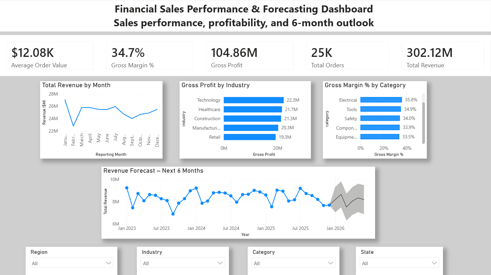
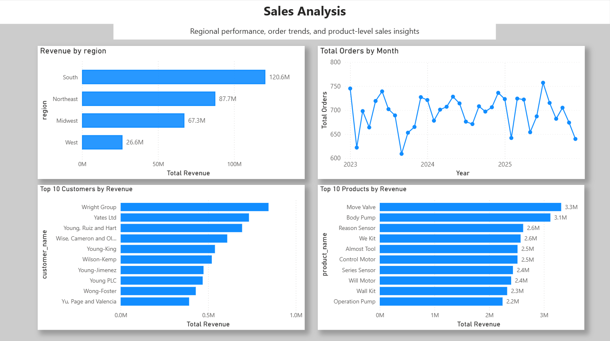

# Financial Sales Performance & Forecasting Dashboard

## Project Overview

This project analyzes financial sales performance using Power BI to evaluate revenue, profitability, regional performance, customer concentration, product performance, and monthly sales trends. The dashboard also includes a six-month revenue forecast to support forward-looking financial analysis and business planning.

The report is structured into two analytical views: an Executive Overview for high-level performance monitoring and a Sales Analysis page for deeper regional, customer, product, and order-level analysis.

## Business Objective

The objective of this project was to transform transactional sales data into an interactive financial reporting solution that enables stakeholders to:

- Monitor core financial KPIs and overall sales performance
- Evaluate revenue and gross profit trends
- Compare profitability across product categories and industries
- Identify high-performing regions, customers, and products
- Analyze monthly order volume and sales patterns
- Assess the six-month revenue outlook using time-series forecasting

## Tools & Technologies

- Power BI
- DAX
- Power Query
- Data Visualization
- Financial Analysis
- Time-Series Forecasting

## Dashboard Preview

### Executive Overview

### Sales Analysis

## Key Performance Indicators

The dashboard tracks five core financial and operational KPIs:

- **Total Revenue:** $302.12M
- **Gross Profit:** $104.86M
- **Gross Margin:** 34.7%
- **Total Orders:** 25K
- **Average Order Value:** $12.08K

These KPIs provide an executive-level view of overall sales performance, profitability, transaction volume, and average revenue generated per order.

## Key Insights

- The **South generated $120.6M in revenue**, making it the highest-performing region and accounting for approximately 40% of total revenue.
- **Technology produced the highest gross profit at $22.3M**, followed closely by Healthcare at $21.7M and Construction at $21.3M.
- Gross margins remained relatively consistent across leading product categories, with the highest-performing categories generating margins of approximately **35%–36%**.
- Monthly revenue remained broadly stable, generally ranging between **$24M and $26M**, although several short-term declines indicate periodic sales volatility.
- **Move Valve and Body Pump were the two highest-revenue products**, generating approximately $3.3M and $3.1M respectively.
- Revenue is concentrated geographically, with the **South and Northeast materially outperforming the Midwest and West**.
- The six-month revenue forecast indicates continued monthly revenue in the approximate **$7M–$9M range**, while the widening confidence interval highlights increased uncertainty further into the forecast horizon.

## Business Recommendations

Based on the analysis, the business should investigate the commercial drivers behind the South region's revenue leadership and determine whether successful customer acquisition, pricing, or product strategies can be replicated in lower-performing regions. Management should also prioritize high-margin categories and leading products while evaluating opportunities to improve revenue contribution from the West.

The forecast should be incorporated into rolling financial planning and reviewed as new monthly sales data becomes available. Because forecast uncertainty increases over the six-month horizon, leadership should use the forecast as a planning range rather than a fixed revenue target.

## Data Model & DAX Measures

The analysis was built from a detailed sales dataset containing order, customer, product, geographic, revenue, and cost information. Power Query was used to prepare the dataset for reporting, while DAX measures were created to calculate financial and operational KPIs.

Key measures developed include:

- Total Revenue
- Total Orders
- Gross Profit
- Gross Margin %
- Average Order Value
- Revenue Year-over-Year %
- Order Year-over-Year %

The dashboard uses a reporting month hierarchy to support time-based trend analysis and Power BI forecasting functionality to generate a six-month revenue outlook.

## Repository Contents

- `financial-sales-performance-forecasting-dashboard.pbix` — Interactive Power BI dashboard
- `executive-overview.png` — Executive dashboard preview
- `sales-analysis.png` — Detailed sales analysis preview
- `README.md` — Project documentation

## Author

**Christian Montano**

Data Analyst | Power BI | SQL | Python | Financial Analytics
